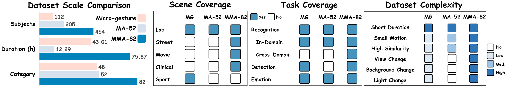
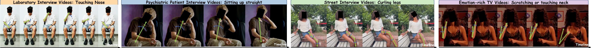
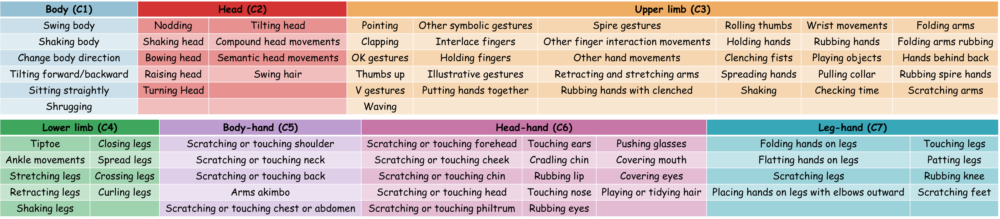
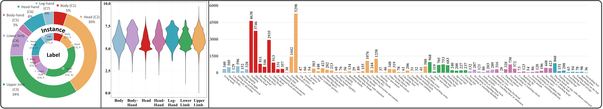
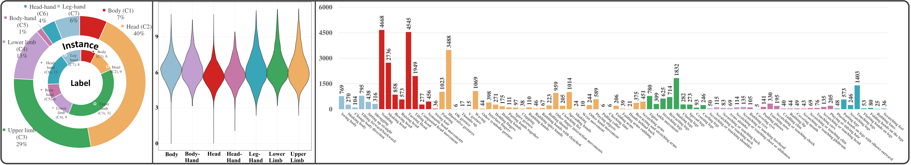
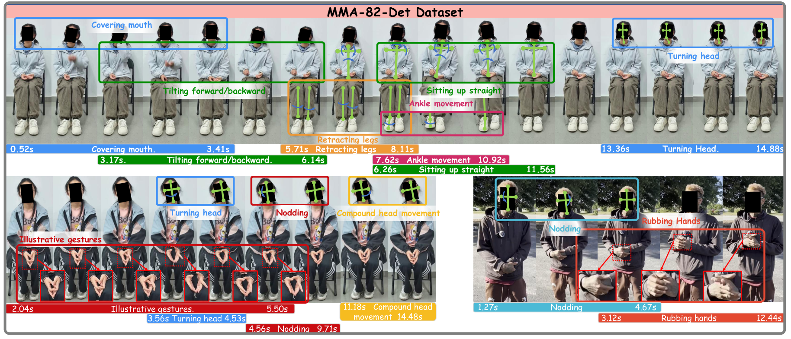
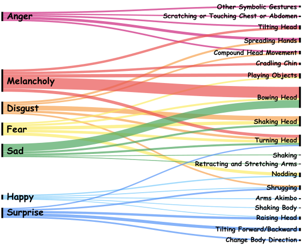
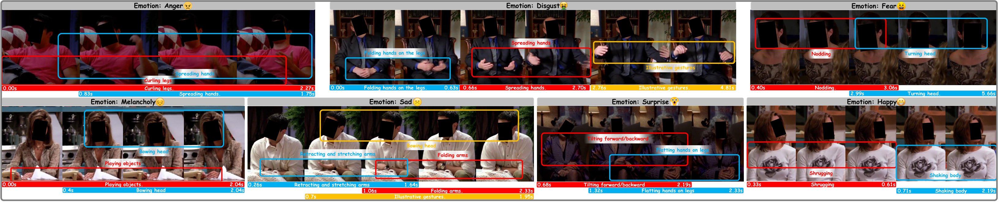

<p align="center">
  <h1 align="center">MMA-82: A New Multi-Domain Benchmark for Micro-Action Recognition and Detection <br/>Submitted to IEEE TMM 2026</h1>
</p>

<p align="center">
  <a href="https://scholar.google.com/citations?user=vhPSOkEAAAAJ&hl=zh-CN&oi=ao">Yanbin Hao</a><sup>*</sup>,
  <a href="https://scholar.google.com/citations?user=EpYnDCkAAAAJ&hl=zh-CN">Pengyu Liu</a><sup>*</sup>,
  Xing Wei,
  Xun Yang,
  Dan Guo,
  <a href="https://scholar.google.com/citations?user=rHagaaIAAAAJ&hl=zh-CN">Meng Wang</a>
</p>

<p align="center">
  Hefei University of Technology &nbsp; | &nbsp; University of Science and Technology of China
  <br/>
  <sup>*</sup> Equal contribution
</p>

<p align="center">
  📄 <a href="static/pdfs/MAR__TMM2026.pdf"><b>Paper</b></a>
  &nbsp; | &nbsp;
  📚 <a href="https://arxiv.org/abs/2606.14096"><b>arXiv</b></a>
  &nbsp; | &nbsp;
  🏠 <a href="https://lpynow.github.io/MMA-82-AIM/"><b>Project Page</b></a>
  &nbsp; | &nbsp;
  🤗 <a href="https://huggingface.co/datasets/lpynow/MAR_plus_plus"><b>Dataset</b></a>
  &nbsp; | &nbsp;
  ⭐ <a href="https://github.com/LpyNow/MMA-82"><b>Code</b></a>
</p>

---

## 📢 News

- **2026.06**: MMA-82 paper, project page, and dataset links are available.
- **2026.06**: We introduce MMA-82, a multi-domain benchmark for micro-action recognition and multi-label temporal detection.

## 🔎 Overview

MMA-82 extends micro-action analysis from controlled laboratory settings to realistic multi-domain scenarios. It expands the previous MA-52 label space from 52 to 82 fine-grained whole-body micro-action categories and covers four domains: laboratory interviews, psychiatric patient interviews, street interviews, and emotion-rich television videos.

MMA-82 is designed around two core tasks:

- **Micro-Action Recognition**: classify trimmed clips into fine-grained body-level and action-level micro-action categories.
- **Multi-label Micro-Action Detection**: localize and classify all micro-action instances in untrimmed videos, including dense or overlapping subtle actions.

The benchmark further supports in-domain, cross-domain, zero-shot, and few-shot evaluation protocols, making it a challenging testbed for realistic micro-action understanding.

<p align="center">
  
</p>

<p align="center">
  
</p>

## 🧭 Quick Navigation

In this repository, we provide:

- 📦 **MMA-82 Dataset**: 79,574 annotated micro-action instances across four source domains.
  - [Dataset Scale](#-dataset-scale)
  - [MMA-82-Rec](#mma-82-rec)
  - [MMA-82-Det](#mma-82-det)
- 🧪 **Benchmark Tasks**: recognition and multi-label temporal detection.
  - [Evaluation Protocols](#-evaluation-protocols)
  - [Baseline Results](#-baseline-results)
- 🎭 **Emotion Analysis**: micro-actions as complementary affective cues.
  - [Emotion and Micro-Actions](#-emotion-and-micro-actions)
- 📑 **Citation**: BibTeX entry for citing MMA-82.
  - [Citation](#-citation)

## 📦 Dataset Scale

MMA-82 contains 82 action-level categories organized into seven body-level groups: **Body**, **Head**, **Upper Limb**, **Lower Limb**, **Body-Hand**, **Head-Hand**, and **Leg-Hand**.

| Split | Videos / Clips | Instances | Duration | Subjects | Description |
|:--|--:|--:|--:|--:|:--|
| **MMA-82-Rec** | 39,816 clips | 39,816 | 28.94h | 454 | Trimmed clips for micro-action recognition |
| **MMA-82-Det** | 11,180 videos | 39,758 | 46.93h | 434 | Untrimmed videos for multi-label temporal detection |
| **Total** | - | **79,574** | **75.87h** | **454** | Four domains and 82 action categories |

<p align="center">
  
</p>

### MMA-82-Rec

MMA-82-Rec contains 39,816 trimmed clips. Each clip is annotated with a body-level group and an action-level micro-action category.

| Data Source | Train | Val | Test | Total Clips | Total Duration | Avg. Length | Subjects |
|:--|--:|--:|--:|--:|--:|--:|--:|
| Laboratory Interviews | 15,820 | 5,636 | 6,053 | 27,509 | 20.48h | 2.68s | 229 |
| Psychiatric Interviews | 4,203 | 1,398 | 1,410 | 7,011 | 5.72h | 2.94s | 19 |
| Street Interviews | 2,358 | 792 | 775 | 3,925 | 2.10h | 1.92s | 26 |
| Emotion Videos | 795 | 247 | 329 | 1,371 | 0.64h | 1.67s | 180 |
| **Total** | **23,176** | **8,073** | **8,567** | **39,816** | **28.94h** | **2.62s** | **454** |

<p align="center">
  
</p>

### MMA-82-Det

MMA-82-Det contains 11,180 untrimmed videos and 39,758 temporal action instances. Each video contains **3.56** micro-action instances on average, and each instance lasts approximately **3.66s**.

<p align="center">
  
</p>

## 🧪 Evaluation Protocols

### Micro-Action Recognition

Given a trimmed video clip, the model predicts the target micro-action category at both action and body levels.

- **In-domain setting**: train, validation, and test splits come from the same source domain.
- **Cross-domain zero-shot setting**: train on laboratory interviews and test directly on another domain.
- **Cross-domain few-shot setting**: train on laboratory interviews and adapt with a small number of labeled target-domain samples.
- **Metrics**: Top-1 Acc, Top-5 Acc, mean class accuracy (MCA), Macro F1, and Micro F1.

### Multi-label Micro-Action Detection

Given an untrimmed video, the model predicts a set of temporal action proposals:

```text
(start_time, end_time, action_category, confidence_score)
```

- **Goal**: detect every micro-action instance and classify its category.
- **Challenge**: actions are short, subtle, dense, and may co-occur in rapid succession.
- **Metrics**: Detection-mAP at multiple temporal IoU thresholds, reported at both action and body levels.

## 📊 Baseline Results

### Recognition: In-Domain Summary

The paper evaluates skeleton-based **PoseC3D** and RGB-based **GC-TSM** baselines. The table below reports action-level test metrics.

| Sub-Dataset | Method | Top-1 Acc | Top-5 Acc | MCA | Macro F1 |
|:--|:--|--:|--:|--:|--:|
| MMA-82-Rec (All) | Skeleton | 56.62 | 80.45 | 36.77 | 39.39 |
| MMA-82-Rec (All) | RGB | **60.43** | **86.14** | **38.98** | **39.56** |
| Laboratory Interviews | Skeleton | 64.84 | 87.81 | 44.88 | **47.03** |
| Laboratory Interviews | RGB | **68.15** | **92.83** | **48.01** | 46.48 |
| Psychiatric Interviews | Skeleton | 41.63 | 68.79 | **15.74** | **17.65** |
| Psychiatric Interviews | RGB | **46.74** | **72.13** | 14.10 | 13.64 |
| Street Interviews | Skeleton | **40.77** | 70.71 | **19.49** | **20.70** |
| Street Interviews | RGB | 39.87 | **73.55** | 12.75 | 12.56 |
| Emotion Videos | Skeleton | 7.29 | 17.93 | 3.72 | 3.11 |
| Emotion Videos | RGB | **25.53** | **52.89** | **12.20** | **11.05** |

### Recognition: Cross-Domain Summary

PoseC3D is trained on laboratory interviews and evaluated on target domains under zero-shot and few-shot protocols.

| Target Domain | Protocol | Action Top-1 | Action Top-5 | Action MCA | Body Top-1 |
|:--|:--|--:|--:|--:|--:|
| Psychiatric Interviews | Zero-Shot | 27.30 | 50.28 | 14.25 | 68.58 |
| Psychiatric Interviews | 1-Shot | **30.27** | **58.62** | **22.82** | 72.48 |
| Psychiatric Interviews | 5-Shot | 30.12 | 58.60 | 22.72 | 72.60 |
| Psychiatric Interviews | 10-Shot | 30.13 | 58.59 | 22.71 | **72.64** |
| Street Interviews | Zero-Shot | 20.65 | 44.90 | 10.65 | 53.16 |
| Street Interviews | 1-Shot | 21.38 | 45.64 | 15.60 | 54.95 |
| Street Interviews | 5-Shot | 21.58 | **46.10** | 16.17 | 64.91 |
| Street Interviews | 10-Shot | **22.52** | 45.92 | **17.76** | **65.64** |
| Emotion Videos | Zero-Shot | 14.13 | 32.98 | 6.63 | **43.92** |
| Emotion Videos | 1-Shot | 17.26 | 39.77 | 14.00 | 41.43 |
| Emotion Videos | 5-Shot | 17.48 | 41.75 | 15.20 | 42.35 |
| Emotion Videos | 10-Shot | **17.70** | **42.53** | **15.43** | 42.03 |

### Detection: AdaTAD on MMA-82-Det

| Backbone | Action mAP@0.2 | Action mAP@0.5 | Action mAP@0.7 | Action Avg | Body mAP@0.2 | Body mAP@0.5 | Body mAP@0.7 | Body Avg | AVG |
|:--|--:|--:|--:|--:|--:|--:|--:|--:|--:|
| VideoMAE-S | 20.88 | 12.72 | 5.56 | 12.09 | 48.18 | 28.78 | 13.91 | 25.44 | 18.77 |
| VideoMAE-B | 22.62 | 14.67 | 6.32 | 13.59 | 50.95 | 30.46 | 12.23 | 29.13 | 21.36 |
| VideoMAE-L | 22.74 | 15.60 | **7.68** | 14.98 | **55.48** | 33.01 | 14.06 | **31.83** | **23.41** |
| VideoMAE-H | **26.53** | **17.56** | 7.55 | **16.08** | 54.71 | **33.64** | **14.17** | 30.05 | 23.07 |

<p align="center">
  
</p>

<p align="center">
  
</p>

## 🎭 Emotion and Micro-Actions

MMA-82 also studies how micro-actions relate to affective states. The paper shows that micro-actions are strongly associated with emotions and provide complementary cues beyond facial micro-expressions.

| Setting | Method | Top-1 Acc | F1 |
|:--|:--|--:|--:|
| Micro-Expression Only | DeepFace | 22.86 | 17.54 |
| Micro-Action Only | TSM | 32.38 | 31.86 |
| Both | DeepFace + TSM | **32.86** | **32.36** |

Key observations:

- Sad and melancholy both correlate with **bowing head** and **turning head**.
- Sad contains more explicit negative bodily actions, while melancholy is subtler and more inward.
- Micro-actions alone outperform facial micro-expression cues under the reported setup.
- Combining micro-actions and micro-expressions improves over the facial baseline.

<p align="center">
  
</p>

<p align="center">
  
</p>

## 📥 Dataset

The dataset page is available on Hugging Face:

```bash
hf download lpynow/MAR_plus_plus \
  --repo-type dataset \
  --local-dir data/MMA-82
```

Please refer to the released dataset card and project page for the latest file organization, annotation format, and usage notes.

## 📑 Citation

If you find MMA-82 useful for your research, please consider citing our paper:

```bibtex
@misc{hao2026newmultidomainbenchmarkmicroaction,
  title={A New Multi-Domain Benchmark for Micro-Action Recognition and Detection},
  author={Hao, Yanbin and Liu, Pengyu and Wei, Xing and Yang, Xun and Guo, Dan and Wang, Meng},
  year={2026},
  eprint={2606.14096},
  archivePrefix={arXiv},
  primaryClass={cs.CV},
  url={https://arxiv.org/abs/2606.14096}
}
```

## 🙏 Acknowledgement

The MMA-82 project page is adapted from the Academic Project Page Template and the Nerfies project page. We also thank the authors of MA-52, MMA-52, PoseC3D, GC-TSM, AdaTAD, VideoMAE, DeepFace, and related micro-action / micro-expression benchmarks for their inspiring work.
